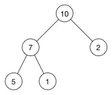

## 堆


堆就是用数组实现的二叉树，所有它没有使用父指针或者子指针。堆根据“堆属性”来排序，“堆属性”决定了树中节点的位置。

堆的常用方法：

- 构建优先队列
- 支持堆排序
- 快速找出一个集合中的最小值（或者最大值）


### 堆属性

堆分为两种：**最大堆**和**最小堆**，两者的差别在于节点的排序方式。

在最大堆中，父节点的值比每一个子节点的值都要大。

在最小堆中，父节点的值比每一个子节点的值都要小。

这就是所谓的“堆属性”，并且这个属性对堆中的每一个节点都成立。





```
这是一个最大堆，，因为每一个父节点的值都比其子节点要大。
10比7和2大，7比5和1大
```

根据这一属性，那么最大堆总是将其中的最大值存放在树的根节点。而对于最小堆，根节点中的元素总是树中的最小值。

堆属性非常的有用，因为堆常常被当做优先队列使用，因为可以快速的访问到“最重要”的元素。

**注意：**堆的根节点中存放的是最大或者最小元素，但是其他节点的排序顺序是未知的。


### 堆和普通树的区别

堆并不能取代二叉搜索树，它们之间有相似之处也有一些不同。我们来看一下两者的主要差别：

**节点的顺序。**在二叉搜索树中，左子节点必须比父节点小，右子节点必须必比父节点大。但是在堆中并非如此。在最大堆中两个子节点都必须比父节点小，而在最小堆中，它们都必须比父节点大。


**内存占用。**普通树占用的内存空间比它们存储的数据要多。你必须为节点对象以及左/右子节点指针分配额为是我内存。堆仅仅使用一个数据来村塾数组，且不使用指针。


**平衡。**二叉搜索树必须是“平衡”的情况下，其大部分操作的复杂度才能达到**O(log n)**。你可以按任意顺序位置插入/删除数据，或者使用 AVL 树或者红黑树，但是在堆中实际上不需要整棵树都是有序的。我们只需要满足对属性即可，所以在堆中平衡不是问题。因为堆中数据的组织方式可以保证**O(log n)** 的性能。


**搜索。**在二叉树中搜索会很快，但是在堆中搜索会很慢。在堆中搜索不是第一优先级，因为使用堆的目的是将最大（或者最小）的节点放在最前面，从而快速的进行相关插入、删除操作。


摘录： [数据结构：堆（Heap）](https://www.jianshu.com/p/6b526aa481b1)

