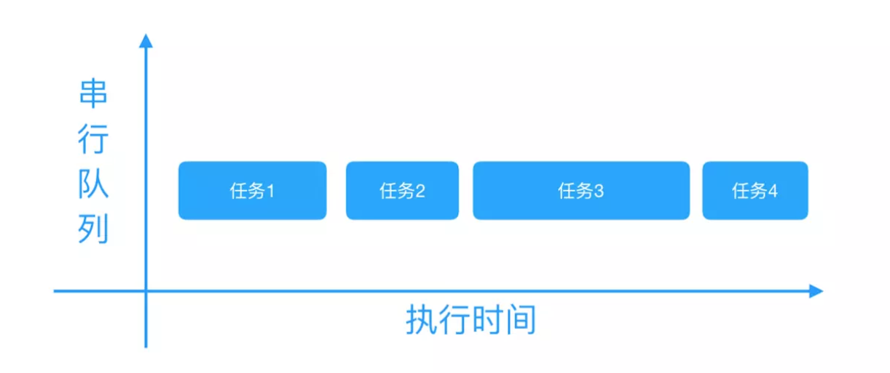
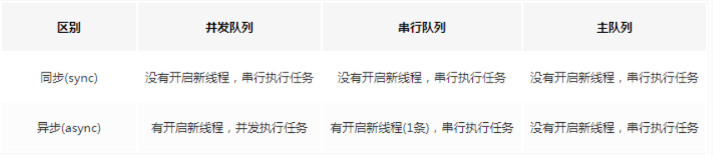
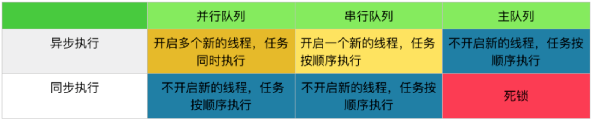

##### GCD

http://www.cocoachina.com/ios/20170707/19769.html

https://www.jianshu.com/p/2d57c72016c6

http://www.cocoachina.com/ios/20170829/20404.html


Grand Central Dispatch(GCD) 是 Apple 开发的一个多核编程的较新的解决方法。它主要用于优化应用程序以支持多核处理器以及其他对称多处理系统。它是一个在线程池模式的基础上执行的并发任务。


好处：

```
GCD 可用于多核的并行运算

GCD 会自动利用更多的 CPU 内核（比如双核、四核）

GCD 会自动管理线程的生命周期（创建线程、调度任务、销毁线程）

程序员只需要告诉 GCD 想要执行什么任务，不需要编写任何线程管理代码
```


- **同步执行（sync）：**

同步添加任务到指定的队列中，在添加的任务执行结束之前，会一直等待，直到队列里面的任务完成之后再继续执行。

只能在当前线程中执行任务，不具备开启新线程的能力


- **异步执行（async）：**

异步添加任务到指定的队列中，它不会做任何等待，可以继续执行任务。

可以在新的线程中执行任务，具备开启新线程的能力。

注意： 异步执行（async） 虽然具有开启新线程的能力，但是并不一定开启新线程。


#### **队列（Dispatch Queue）**：

这里的队列指执行任务的等待队列，即用来存放任务的队列。队列是一种特殊的线性表，采用 FIFO（先进先出）的原则，即新任务总是被插入到队列的末尾，而读取任务的时候总是从队列的头部开始读取。每读取一个任务，则从队列中释放一个任务。

在 GCD 中有两种队列：串行队列和并发队列。


- **串行队列（Serial Dispatch Queue）：**

每次只有一个任务被执行。让任务一个接着一个地执行。（只开启一个线程，一个任务执行完毕后，再执行下一个任务）


- **并发队列（Concurrent Dispatch Queue）：**

异步添加任务到指定的队列中，它不会做任何等待，可以继续执行任务。

注意：并发队列 的并发功能只有在异步（dispatch_async）函数下才有效




#### **队列的创建/获取**

1、可以使用dispatch_queue_create来创建队列，需要传入两个参数，第一个参数表示队列的唯一标识符，用于 DEBUG，可为空，Dispatch Queue 的名称推荐使用应用程序 ID 这种逆序全程域名；第二个参数用来识别是串行队列还是并发队列。DISPATCH_QUEUE_SERIAL表示串行队列，DISPATCH_QUEUE_CONCURRENT表示并发队列。

```
// 串行队列的创建方法
dispatch_queue_t queue = dispatch_queue_create("com.ibiaoma.gcdDemo", DISPATCH_QUEUE_SERIAL);
// 并发队列的创建方法
dispatch_queue_t queue = dispatch_queue_create("com.ibiaoma.gcdDemo", DISPATCH_QUEUE_CONCURRENT);
```

2、对于串行队列，GCD 提供了的一种特殊的串行队列：**主队列（Main Dispatch Queue）**。

- 所有放在主队列中的任务，都会放到主线程中执行。

- 可使用dispatch_get_main_queue()获得主队列。

  ```
  // 主队列的获取方法
  dispatch_queue_t queue = dispatch_get_main_queue();
  ```

3、对于并发队列，GCD 默认提供了**全局并发队列（Global Dispatch Queue）**

    可以使用dispatch_get_global_queue来获取。需要传入两个参数。第一个参数表示队列优先级，一般用DISPATCH_QUEUE_PRIORITY_DEFAULT。第二个参数暂时没用，用0即可。

```
// 全局并发队列的获取方法
dispatch_queue_t queue = dispatch_get_global_queue(DISPATCH_QUEUE_PRIORITY_DEFAULT, 0);
```


#### **任务的创建**

```
// 同步执行任务创建方法
dispatch_sync(queue, ^{
    // 这里放同步执行任务代码
});
// 异步执行任务创建方法
dispatch_async(queue, ^{
    // 这里放异步执行任务代码
});
```







### **基本使用**


##### 1、同步 + 并发队列

##### 在当前线程中执行任务，不会开启新线程，执行完一个任务，再执行下一个任务。

```
    //    创建一个并发队列
    dispatch_queue_t queue = dispatch_queue_create("com.ibiaoma.gcdDemo", DISPATCH_QUEUE_CONCURRENT);
    
    //创建同步线程1
    dispatch_sync(queue, ^{
        for (int i = 0; i < 2; ++i) {
            [NSThread sleepForTimeInterval:2];  // 模拟耗时操作
            NSLog(@"%s 1 --- %@", __FUNCTION__,[NSThread currentThread]);
        }
    });
    
打印：
    [ViewController syncConcurrent]_block_invoke 1 --- <NSThread: 0x60000007c980>{number = 1, name = main}
```

从同步执行 + 并发队列中可看到：

- 所有任务都是在当前线程（主线程）中执行的，没有开启新的线程（同步执行不具备开启新线程的能力）。

- 所有任务都在打印的syncConcurrent---begin和syncConcurrent---end之间执行的（同步任务需要等待队列的任务执行结束）。

- 任务按顺序执行的。按顺序执行的原因：虽然并发队列可以开启多个线程，并且同时执行多个任务。但是因为本身不能创建新线程，只有当前线程这一个线程（同步任务不具备开启新线程的能力），所以也就不存在并发。而且当前线程只有等待当前队列中正在执行的任务执行完毕之后，才能继续接着执行下面的操作（同步任务需要等待队列的任务执行结束）。所以任务只能一个接一个按顺序执行，不能同时被执行


##### 2、**异步执行 + 并发队列**

```
//    创建一个并发队列
    dispatch_queue_t queue = dispatch_queue_create("com.ibiaoma.gcdDemo", DISPATCH_QUEUE_SERIAL);
    
    // 创建异步线程1
    dispatch_async(queue, ^{
        for (int i = 0; i < 2; ++i) {
            [NSThread sleepForTimeInterval:2];  // 模拟耗时操作
            NSLog(@"1 --- %@", [NSThread currentThread]);
        }
    });
        // 创建异步线程2
    dispatch_async(queue, ^{
        for (int i = 0; i < 2; ++i) {
            [NSThread sleepForTimeInterval:2];  // 模拟耗时操作
            NSLog(@" 2 --- %@",[NSThread currentThread]);
        }
    });
```


