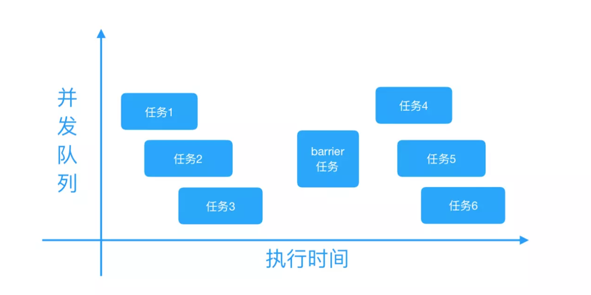

##### GCD其他常用方法

##### 1、**GCD 栅栏方法：dispatch_barrier_async**

适用场景：我们有时需要异步执行两组操作，而且第一组操作执行完之后，才能开始执行第二组操作。这样我们就需要一个相当于 栅栏 一样的一个方法将两组异步执行的操作组给分割起来，当然这里的操作组里可以包含一个或多个任务。这就需要用到dispatch_barrier_async方法在两个操作组间形成栅栏。

dispatch_barrier_async函数会等待前边追加到并发队列中的任务全部执行完毕之后，再将指定的任务追加到该异步队列中。然后在dispatch_barrier_async函数追加的任务执行完毕之后，异步队列才恢复为一般动作，接着追加任务到该异步队列并开始执行。具体如下图所示：



```
- (void)barrier
{
    //创建一个并发队列
    dispatch_queue_t queue = dispatch_queue_create("com.ibiaoma.gcdDemo", DISPATCH_QUEUE_CONCURRENT);

    //任务1
    dispatch_async(queue, ^{
        for (int i = 0; i < 2; ++i) {
            [NSThread sleepForTimeInterval:2];  // 模拟耗时操作
            NSLog(@" 1 --- %@",[NSThread currentThread]);
        }
    });
    //任务2
    dispatch_async(queue, ^{
        for (int i = 0; i < 2; ++i) {
            [NSThread sleepForTimeInterval:2];  // 模拟耗时操作
            NSLog(@" 2 --- %@",[NSThread currentThread]);
        }
    });

    //添加栅栏
    dispatch_barrier_async(queue, ^{
        for (int i = 0; i < 2; ++i) {
            [NSThread sleepForTimeInterval:2];  // 模拟耗时操作
            NSLog(@" barrier --- %@",[NSThread currentThread]);
        }
    });

    //任务3
    dispatch_async(queue, ^{
        for (int i = 0; i < 2; ++i) {
            [NSThread sleepForTimeInterval:2];  // 模拟耗时操作
            NSLog(@" 3 --- %@",[NSThread currentThread]);
        }
    });
    //任务4
    dispatch_async(queue, ^{
        for (int i = 0; i < 2; ++i) {
            [NSThread sleepForTimeInterval:2];  // 模拟耗时操作
            NSLog(@" 4 --- %@",[NSThread currentThread]);
        }
    });
}

打印：
1 --- <NSThread: 0x604000269e40>{number = 4, name = (null)}
2 --- <NSThread: 0x604000269fc0>{number = 3, name = (null)}
1 --- <NSThread: 0x604000269e40>{number = 4, name = (null)}
2 --- <NSThread: 0x604000269fc0>{number = 3, name = (null)}
barrier --- <NSThread: 0x604000269fc0>{number = 3, name = (null)}
barrier --- <NSThread: 0x604000269fc0>{number = 3, name = (null)}
3 --- <NSThread: 0x604000269fc0>{number = 3, name = (null)}
4 --- <NSThread: 0x604000269e40>{number = 4, name = (null)}
4 --- <NSThread: 0x604000269e40>{number = 4, name = (null)}
3 --- <NSThread: 0x604000269fc0>{number = 3, name = (null)}
```

##### 2、**GCD 延时执行方法：dispatch_after**

我们经常会遇到这样的需求：在指定时间（例如3秒）之后执行某个任务。可以用 GCD 的dispatch_after函数来实现。

需要注意的是：dispatch_after函数并不是在指定时间之后才开始执行处理，而是在指定时间之后将任务追加到主队列中。严格来说，这个时间并不是绝对准确的，但想要大致延迟执行任务，dispatch_after函数是很有效的。

```
- (void)after
{
    dispatch_after(dispatch_time(DISPATCH_TIME_NOW, (int64_t)(2.0 * NSEC_PER_SEC)), dispatch_get_main_queue(), ^{
        // 2.0秒后异步追加任务代码到主队列，并开始执行
        NSLog(@"after---%@",[NSThread currentThread]);  // 打印当前线程
    });
}

打印：
2019-01-11 15:59:56.252355+0800 gcdDemo[3650:149056] currentThread---<NSThread: 0x600000067e40>{number = 1, name = main}
2019-01-11 15:59:56.252504+0800 gcdDemo[3650:149056] asyncMain---begin
2019-01-11 15:59:58.448364+0800 gcdDemo[3650:149056] after---<NSThread: 0x600000067e40>{number = 1, name = main}
```

##### 3、**一次性代码（只执行一次）：dispatch_once**

我们在创建单例、或者有整个程序运行过程中只执行一次的代码时，我们就用到了 GCD 的dispatch_once函数。使用dispatch_once函数能保证某段代码在程序运行过程中只被执行1次，并且即使在多线程的环境下，dispatch_once也可以保证线程安全。

```
- (void)once
{
    static dispatch_once_t onceToken;
    dispatch_once(&onceToken, ^{
        // 只执行1次的代码(这里面默认是线程安全的)
    });
}
```

##### 4、**GCD 快速迭代方法：dispatch_apply**

- 通常我们会用 for 循环遍历，但是 GCD 给我们提供了快速迭代的函数dispatch_apply。dispatch_apply按照指定的次数将指定的任务追加到指定的队列中，并等待全部队列执行结束。

```
我们可以利用异步队列同时遍历。比如说遍历 0~5 这6个数字，for 循环的做法是每次取出一个元素，逐个遍历。dispatch_apply可以同时遍历多个数字。
- (void)apply
{
    dispatch_queue_t queue = dispatch_get_global_queue(DISPATCH_QUEUE_PRIORITY_DEFAULT, 0);

    NSLog(@"apply---begin");
    dispatch_apply(6, queue, ^(size_t index) {
        NSLog(@"%zd---%@",index, [NSThread currentThread]);
    });
    NSLog(@"apply---end");
}

打印：
apply---begin
0---<NSThread: 0x6040002609c0>{number = 1, name = main}
2---<NSThread: 0x60000046f980>{number = 3, name = (null)}
3---<NSThread: 0x60400046dd00>{number = 5, name = (null)}
1---<NSThread: 0x60000046f9c0>{number = 4, name = (null)}
4---<NSThread: 0x6040002609c0>{number = 1, name = main}
5---<NSThread: 0x60000046f980>{number = 3, name = (null)}
apply---end
```

从dispatch_apply相关代码执行结果中可以看出：

- 0~5 打印顺序不定，最后打印了apply---end。

因为是在并发队列中异步队执行任务，所以各个任务的执行时间长短不定，最后结束顺序也不定。但是apply---end一定在最后执行。这是因为dispatch_apply函数会等待全部任务执行完毕。

##### 5、**GCD 的队列组：dispatch_group**

有时候我们会有这样的需求：分别异步执行2个耗时任务，然后当2个耗时任务都执行完毕后再回到主线程执行任务。这时候我们可以用到 GCD 的队列组。

- 调用队列组的dispatch_group_async先把任务放到队列中，然后将队列放入队列组中。或者使用队列组的dispatch_group_enter、dispatch_group_leave组合 来实现dispatch_group_async。

- 调用队列组的dispatch_group_notify回到指定线程执行任务。或者使用dispatch_group_wait回到当前线程继续向下执行（会阻塞当前线程）。

##### 5.1**dispatch_group_notify**

监听 group 中任务的完成状态，当所有的任务都执行完成后，追加任务到 group 中，并执行任务。

```
- (void)groupNotify
{
    NSLog(@"currentThread---%@",[NSThread currentThread]);  // 打印当前线程
    NSLog(@"group---begin");

    //创建一个队列组
    dispatch_group_t group = dispatch_group_create();

    //往队列组中添加任务1
    dispatch_group_async(group, dispatch_get_global_queue(DISPATCH_QUEUE_PRIORITY_DEFAULT, 0), ^{
        for (int i = 0; i < 2; ++i) {
            [NSThread sleepForTimeInterval:2];  // 模拟耗时操作
            NSLog(@" 1 --- %@",[NSThread currentThread]);
        }
    });

    //往队列组中添加任务2
    dispatch_group_async(group, dispatch_get_global_queue(DISPATCH_QUEUE_PRIORITY_DEFAULT, 0), ^{
        for (int i = 0; i < 2; ++i) {
            [NSThread sleepForTimeInterval:2];  // 模拟耗时操作
            NSLog(@" 2 --- %@",[NSThread currentThread]);
        }
    });

    // 等前面的异步任务1、任务2都执行完毕后，回到主线程执行下边任务
    dispatch_group_notify(group, dispatch_get_main_queue(), ^{
        for (int i = 0; i < 2; ++i) {
            [NSThread sleepForTimeInterval:2];  // 模拟耗时操作
            NSLog(@" 3 --- %@",[NSThread currentThread]);
        }
        NSLog(@"group---end");
    });
}

打印：
currentThread---<NSThread: 0x60000007cb80>{number = 1, name = main}
group---begin
 2 --- <NSThread: 0x6000002707c0>{number = 3, name = (null)}
 1 --- <NSThread: 0x6040004690c0>{number = 4, name = (null)}
 1 --- <NSThread: 0x6040004690c0>{number = 4, name = (null)}
 2 --- <NSThread: 0x6000002707c0>{number = 3, name = (null)}
 3 --- <NSThread: 0x60000007cb80>{number = 1, name = main}
 3 --- <NSThread: 0x60000007cb80>{number = 1, name = main}
group---end
```

从dispatch_group_notify相关代码运行输出结果可以看出：

当所有任务都执行完成之后，才执行dispatch_group_notify block中的任务。

##### 5.2、 dispatch_group_wait

暂停当前线程（阻塞当前线程），等待指定的 group 中的任务执行完成后，才会往下继续执行。

```
- (void)groupWait
{
    NSLog(@"currentThread---%@",[NSThread currentThread]);  // 打印当前线程
    NSLog(@"group---begin");

    dispatch_group_t group = dispatch_group_create();

    dispatch_group_async(group, dispatch_get_global_queue(DISPATCH_QUEUE_PRIORITY_DEFAULT, 0), ^{
        for (int i = 0; i < 2; ++i) {
            [NSThread sleepForTimeInterval:2];  // 模拟耗时操作
            NSLog(@" 1 --- %@",[NSThread currentThread]);
        }
    });

    dispatch_group_async(group, dispatch_get_global_queue(DISPATCH_QUEUE_PRIORITY_DEFAULT, 0), ^{
        for (int i = 0; i < 2; ++i) {
            [NSThread sleepForTimeInterval:2];  // 模拟耗时操作
            NSLog(@" 2 --- %@",[NSThread currentThread]);
        }
    });

    // 等待上面的任务全部完成后，会往下继续执行（会阻塞当前线程）
    dispatch_group_wait(group, DISPATCH_TIME_FOREVER);
    NSLog(@"group---end");
}

打印：
currentThread---<NSThread: 0x600000077400>{number = 1, name = main}
group---begin
 1 --- <NSThread: 0x60000027ffc0>{number = 3, name = (null)}
 2 --- <NSThread: 0x60400046afc0>{number = 4, name = (null)}
 1 --- <NSThread: 0x60000027ffc0>{number = 3, name = (null)}
 2 --- <NSThread: 0x60400046afc0>{number = 4, name = (null)}
group---end
```

从dispatch_group_wait相关代码运行输出结果可以看出：

当所有任务执行完成之后，才执行dispatch_group_wait之后的操作。但是，使用dispatch_group_wait会阻塞当前线程。

##### 5.3、 dispatch_group_enter、dispatch_group_leave

- dispatch_group_enter标志着一个任务追加到 group，执行一次，相当于 group 中未执行完毕任务数+1

- dispatch_group_leave标志着一个任务离开了 group，执行一次，相当于 group 中未执行完毕任务数-1。

- 当 group 中未执行完毕任务数为0的时候，才会使dispatch_group_wait解除阻塞，以及执行追加到dispatch_group_notify中的任务。

```
- (void)groupEnterAndLeave
{
    NSLog(@"currentThread---%@",[NSThread currentThread]);  // 打印当前线程
    NSLog(@"group---begin");

    dispatch_group_t group = dispatch_group_create();
    dispatch_queue_t queue = dispatch_get_global_queue(DISPATCH_QUEUE_PRIORITY_DEFAULT, 0);

    dispatch_group_enter(group);
    dispatch_async(queue, ^{
        for (int i = 0; i < 2; ++i) {
            [NSThread sleepForTimeInterval:2];  // 模拟耗时操作
            NSLog(@" 1 --- %@",[NSThread currentThread]);
        }
        dispatch_group_leave(group);
    });

    dispatch_group_enter(group);
    dispatch_async(queue, ^{
        for (int i = 0; i < 2; ++i) {
            [NSThread sleepForTimeInterval:2];  // 模拟耗时操作
            NSLog(@" 2 --- %@",[NSThread currentThread]);
        }
        dispatch_group_leave(group);
    });

    dispatch_group_notify(group, dispatch_get_main_queue(), ^{
        // 等前面的异步操作都执行完毕后，回到主线程.
        for (int i = 0; i < 2; ++i) {
            [NSThread sleepForTimeInterval:2];  // 模拟耗时操作
            NSLog(@" 3 --- %@",[NSThread currentThread]);
        }
        NSLog(@"group---end");
    });
}

打印：
 currentThread---<NSThread: 0x600000260300>{number = 1, name = main}
 group---begin
  1 --- <NSThread: 0x60000047fa80>{number = 3, name = (null)}
  2 --- <NSThread: 0x60400026c540>{number = 4, name = (null)}
  2 --- <NSThread: 0x60400026c540>{number = 4, name = (null)}
  1 --- <NSThread: 0x60000047fa80>{number = 3, name = (null)}
  3 --- <NSThread: 0x600000260300>{number = 1, name = main}
  3 --- <NSThread: 0x600000260300>{number = 1, name = main}
 group---end
```

从dispatch_group_enter、dispatch_group_leave相关代码运行结果中可以看出：当所有任务执行完成之后，才执行 dispatch_group_notify 中的任务。这里的dispatch_group_enter、dispatch_group_leave组合，其实等同于dispatch_group_async。

##### 6、**信号量：dispatch_semaphore**

GCD 中的信号量是指**Dispatch Semaphore**，是持有计数的信号。类似于过高速路收费站的栏杆。可以通过时，打开栏杆，不可以通过时，关闭栏杆。在**Dispatch Semaphore**中，使用计数来完成这个功能，计数为0时等待，不可通过。计数为1或大于1时，计数减1且不等待，可通过。**Dispatch Semaphore**提供了三个函数。

- dispatch_semaphore_create：创建一个Semaphore并初始化信号的总量

- dispatch_semaphore_signal：发送一个信号，让信号总量加1

- dispatch_semaphore_wait：可以使总信号量减1，当信号总量为0时就会一直等待（阻塞所在线程），否则就可以正常执行。

注意：信号量的使用前提是：想清楚你需要处理哪个线程等待（阻塞），又要哪个线程继续执行，然后使用信号量。

Dispatch Semaphore 在实际开发中主要用于：

- 保持线程同步，将异步执行任务转换为同步执行任务

- 保证线程安全，为线程加锁

##### **6.1 Dispatch Semaphore 线程同步**

我们在开发中，会遇到这样的需求：异步执行耗时任务，并使用异步执行的结果进行一些额外的操作。换句话说，相当于，将将异步执行任务转换为同步执行任务。

```
比如说：AFNetworking 中 AFURLSessionManager.m 里面的 tasksForKeyPath: 方法。通过引入信号量的方式，等待异步执行任务结果，获取到 tasks，然后再返回该 tasks。
- (NSArray *)tasksForKeyPath:(NSString *)keyPath {
    __block NSArray *tasks = nil;
    
    //创建一个Semaphore并初始化信号的总量
    dispatch_semaphore_t semaphore = dispatch_semaphore_create(0);

    [self.session getTasksWithCompletionHandler:^(NSArray *dataTasks, NSArray *uploadTasks, NSArray *downloadTasks) {
        if ([keyPath isEqualToString:NSStringFromSelector(@selector(dataTasks))]) {
            tasks = dataTasks;
        } else if ([keyPath isEqualToString:NSStringFromSelector(@selector(uploadTasks))]) {
            tasks = uploadTasks;
        } else if ([keyPath isEqualToString:NSStringFromSelector(@selector(downloadTasks))]) {
            tasks = downloadTasks;
        } else if ([keyPath isEqualToString:NSStringFromSelector(@selector(tasks))]) {
            tasks = [@[dataTasks, uploadTasks, downloadTasks] valueForKeyPath:@"@unionOfArrays.self"];
        }
        //发送一个信号，让信号总量加1
        dispatch_semaphore_signal(semaphore);
    }];
    
    //可以使总信号量减1
    dispatch_semaphore_wait(semaphore, DISPATCH_TIME_FOREVER);

    return tasks;
}
```

```
利用 Dispatch Semaphore 实现线程同步，将异步执行任务转换为同步执行任务。

- (void)semaphoreSync
{
    NSLog(@"currentThread---%@",[NSThread currentThread]);  // 打印当前线程
    NSLog(@"semaphore---begin");

    dispatch_queue_t queue = dispatch_get_global_queue(DISPATCH_QUEUE_PRIORITY_DEFAULT, 0);

    dispatch_semaphore_t semaphore = dispatch_semaphore_create(0);

    __block int number = 0;
    dispatch_async(queue, ^{//开启一个异步线程
        [NSThread sleepForTimeInterval:2];              // 模拟耗时操作
        NSLog(@"1---%@",[NSThread currentThread]);      // 打印当前线程

        number = 100;

        dispatch_semaphore_signal(semaphore);
    });

    dispatch_semaphore_wait(semaphore, DISPATCH_TIME_FOREVER);

    NSLog(@"semaphore---end,number = %zd",number);
}

打印：
currentThread---<NSThread: 0x60400007da00>{number = 1, name = main}
semaphore---begin
1---<NSThread: 0x6000004614c0>{number = 3, name = (null)}
semaphore---end,number = 100
```

从 Dispatch Semaphore 实现线程同步的代码可以看到：

- semaphore---end是在执行完  number = 100; 之后才打印的。而且输出结果 number 为 100。这是因为异步执行不会做任何等待，可以继续执行任务。异步执行将任务1追加到队列之后，不做等待，接着执行dispatch_semaphore_wait方法。此时 semaphore == 0，当前线程进入等待状态。然后，异步任务1开始执行。任务1执行到dispatch_semaphore_signal之后，总信号量，此时 semaphore == 1，dispatch_semaphore_wait方法使总信号量减1，正在被阻塞的线程（主线程）恢复继续执行。最后打印semaphore---end,number = 100。这样就实现了线程同步，将异步执行任务转换为同步执行任务。

##### **6.2 Dispatch Semaphore 线程安全和线程同步（为线程加锁）**

**线程安全**：如果你的代码所在的进程中有多个线程在同时运行，而这些线程可能会同时运行这段代码。如果每次运行结果和单线程运行的结果是一样的，而且其他的变量的值也和预期的是一样的，就是线程安全的。

若每个线程中对全局变量、静态变量只有读操作，而无写操作，一般来说，这个全局变量是线程安全的；若有多个线程同时执行写操作（更改变量），一般都需要考虑线程同步，否则的话就可能影响线程安全。

**线程同步**：可理解为线程 A 和 线程 B 一块配合，A 执行到一定程度时要依靠线程 B 的某个结果，于是停下来，示意 B 运行；B 依言执行，再将结果给 A；A 再继续操作。

举个简单例子就是：两个人在一起聊天。两个人不能同时说话，避免听不清(操作冲突)。等一个人说完(一个线程结束操作)，另一个再说(另一个线程再开始操作)。

```
下面，我们模拟火车票售卖的方式，实现 NSThread 线程安全和解决线程同步问题。
场景：总共有50张火车票，有两个售卖火车票的窗口，一个是北京火车票售卖窗口，另一个是上海火车票售卖窗口。两个窗口同时售卖火车票，卖完为止。


- (void)initTicketStatusNotSave
{
    NSLog(@"currentThread---%@",[NSThread currentThread]);  // 打印当前线程
    NSLog(@"semaphore---begin");

    self.ticketSurplusCount = 10;

    dispatch_queue_t queue1 = dispatch_queue_create("com.ibiaoma.gcdDemo", DISPATCH_QUEUE_SERIAL);

    dispatch_queue_t queue2 = dispatch_queue_create("com.ibiaoma.gcdDemo", DISPATCH_QUEUE_SERIAL);

    __weak typeof(self) weakSelf = self;

    dispatch_async(queue1, ^{
        [weakSelf saleTicketNotSave];
    });
    dispatch_async(queue2, ^{
        [weakSelf saleTicketNotSave];
    });
}

- (void)saleTicketNotSave
{
    while (1) {
        if (self.ticketSurplusCount > 0) {
            self.ticketSurplusCount--;
            NSLog(@"%@", [NSString stringWithFormat:@"剩余票数：%d 窗口：%@", self.ticketSurplusCount, [NSThread currentThread]]);
            [NSThread sleepForTimeInterval:0.2];
        }else{
            NSLog(@"所有火车票均已售完");
            break;
        }
    }
}
打印：
currentThread---<NSThread: 0x60000007ee40>{number = 1, name = main}
semaphore---begin
剩余票数：8 窗口：<NSThread: 0x600000474300>{number = 4, name = (null)}
剩余票数：9 窗口：<NSThread: 0x604000464c80>{number = 3, name = (null)}
剩余票数：7 窗口：<NSThread: 0x600000474300>{number = 4, name = (null)}
剩余票数：6 窗口：<NSThread: 0x604000464c80>{number = 3, name = (null)}
剩余票数：5 窗口：<NSThread: 0x604000464c80>{number = 3, name = (null)}
剩余票数：4 窗口：<NSThread: 0x600000474300>{number = 4, name = (null)}
剩余票数：3 窗口：<NSThread: 0x600000474300>{number = 4, name = (null)}
剩余票数：2 窗口：<NSThread: 0x604000464c80>{number = 3, name = (null)}
剩余票数：0 窗口：<NSThread: 0x604000464c80>{number = 3, name = (null)}
剩余票数：1 窗口：<NSThread: 0x600000474300>{number = 4, name = (null)}
所有火车票均已售完
所有火车票均已售完
```

可以看到在不考虑线程安全，不使用 semaphore 的情况下，得到票数是错乱的，这样显然不符合我们的需求，所以我们需要考虑线程安全问题。

###### **6.3 线程安全（使用 semaphore 加锁）**

```
- (void)initTicketStatusNotSave
{
    NSLog(@"currentThread---%@",[NSThread currentThread]);  // 打印当前线程
    NSLog(@"semaphore---begin");

    self.ticketSurplusCount = 10;

    semaphoreLock = dispatch_semaphore_create(1);

    dispatch_queue_t queue1 = dispatch_queue_create("com.ibiaoma.gcdDemo", DISPATCH_QUEUE_SERIAL);

    dispatch_queue_t queue2 = dispatch_queue_create("com.ibiaoma.gcdDemo", DISPATCH_QUEUE_SERIAL);

    __weak typeof(self) weakSelf = self;

    dispatch_async(queue1, ^{
        [weakSelf saleTicketNotSave];
    });
    dispatch_async(queue2, ^{
        [weakSelf saleTicketNotSave];
    });
}

//加锁
- (void)saleTicketSafe
{
    while (1) {

        dispatch_semaphore_wait(semaphoreLock, DISPATCH_TIME_FOREVER);

        if (self.ticketSurplusCount > 0) {
            self.ticketSurplusCount--;
            NSLog(@"%@", [NSString stringWithFormat:@"剩余票数：%d 窗口：%@", self.ticketSurplusCount, [NSThread currentThread]]);
            [NSThread sleepForTimeInterval:0.2];
        }else{
            NSLog(@"所有火车票均已售完");
            break;
        }

        dispatch_semaphore_signal(semaphoreLock);
    }
}

打印：
currentThread---<NSThread: 0x60400006ea40>{number = 1, name = main}
semaphore---begin
剩余票数：9 窗口：<NSThread: 0x604000271640>{number = 3, name = (null)}
剩余票数：8 窗口：<NSThread: 0x60000046a2c0>{number = 4, name = (null)}
剩余票数：6 窗口：<NSThread: 0x604000271640>{number = 3, name = (null)}
剩余票数：7 窗口：<NSThread: 0x60000046a2c0>{number = 4, name = (null)}
剩余票数：5 窗口：<NSThread: 0x604000271640>{number = 3, name = (null)}
剩余票数：5 窗口：<NSThread: 0x60000046a2c0>{number = 4, name = (null)}
剩余票数：3 窗口：<NSThread: 0x604000271640>{number = 3, name = (null)}
剩余票数：4 窗口：<NSThread: 0x60000046a2c0>{number = 4, name = (null)}
剩余票数：2 窗口：<NSThread: 0x604000271640>{number = 3, name = (null)}
剩余票数：1 窗口：<NSThread: 0x60000046a2c0>{number = 4, name = (null)}
所有火车票均已售完
剩余票数：0 窗口：<NSThread: 0x604000271640>{number = 3, name = (null)}
所有火车票均已售完
```

可以看出，在考虑了线程安全的情况下，使用 dispatch_semaphore 机制之后，得到的票数是正确的，没有出现混乱的情况。我们也就解决了多个线程同步的问题。   
