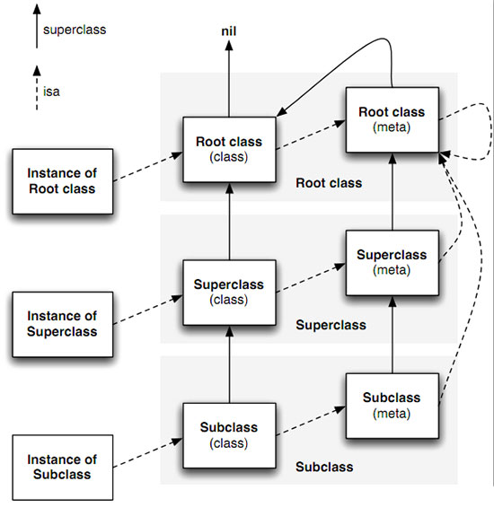

## runtime

#### 一、runtime简介

- RunTime简称运行时。OC就是`运行时机制`，也就是在运行时候的一些机制，其中最主要的是消息机制。

- 对于C语言，`函数的调用在编译的时候会决定调用哪个函数`。

- 对于OC的函数，属于`动态调用过程`，在编译的时候并不能决定真正调用哪个函数，只有在真正运行的时候才会根据函数的名称找到对应的函数来调用。

- 事实证明：

  - 在编译阶段，OC可以`调用任何函数`，即使这个函数并未实现，只要声明过就不会报错。
  - 在编译阶段，C语言调用`未实现的函数`就会报错。

#### 二、作用

1、由objc_msgSend说开始

使用 clang 重写命令:

```
    $ clang -rewrite-objc Test.m
```

然后在同一目录下会多出一个 Test.cpp 文件,双击打开，可以看到 init 方法已经被编译器转化为下面这样：

```
- (instancetype)init
{
    if (self = [super init]) {
        [self show];
    }
    return self;
}


static instancetype _I_Test_init(Test * self, SEL _cmd) {
    if (self = ((Test *(*)(__rw_objc_super *, SEL))(void *)objc_msgSendSuper)((__rw_objc_super){(id)self, (id)class_getSuperclass(objc_getClass("Test"))}, sel_registerName("init"))) {
        ((void (*)(id, SEL))(void *)objc_msgSend)((id)self, sel_registerName("show"));
    }
    return self;
}
```

objc_msgSend 函数被定义在 objc/message.h 目录下，其函数原型是这样：

```
OBJC_EXPORT void objc_msgSend(void /* id self, SEL op, ... */ )
```

该函数有两个参数，一个 id 类型，一个 SEL 类型。

2、SEL 被定义在 objc/objc.h 目录下：

```
typedef struct objc_selector *SEL;
```

它就是个映射到方法的C字符串，你可以用 Objective-C 编译器命令 @selector() 或者 Runtime 系统的 sel_registerName 函数来获得一个 SEL 类型的方法选择器。

3、与 SEL 一样，id 也被定义在 objc/objc.h 目录下：

```
typedef struct objc_object *id;
```

id 是一个结构体指针类型，它可以指向 Objective-C 中的任何对象。objc_object 结构体定义如下：

```
struct objc_object {
    Class _Nonnull isa  OBJC_ISA_AVAILABILITY;
};
```

4、Class也是一个结构体指针类型：

```
typedef struct objc_class *Class;

objc_class 结构体是:
struct objc_class {
    Class _Nonnull isa  OBJC_ISA_AVAILABILITY;

#if !__OBJC2__
    Class _Nullable super_class                              OBJC2_UNAVAILABLE;
    const char * _Nonnull name                               OBJC2_UNAVAILABLE;
    long version                                             OBJC2_UNAVAILABLE;
    long info                                                OBJC2_UNAVAILABLE;
    long instance_size                                       OBJC2_UNAVAILABLE;
    struct objc_ivar_list * _Nullable ivars                  OBJC2_UNAVAILABLE;
    struct objc_method_list * _Nullable * _Nullable methodLists                    OBJC2_UNAVAILABLE;
    struct objc_cache * _Nonnull cache                       OBJC2_UNAVAILABLE;
    struct objc_protocol_list * _Nullable protocols          OBJC2_UNAVAILABLE;
#endif

} OBJC2_UNAVAILABLE;
```

```
我们通常说的类就长这样子：
·Class 也有一个 isa 指针，指向其所属的元类（meta）。
·super_class：指向其超类。
·name：是类名。
·version：是类的版本信息。
·info：是类的详情。
·instance_size：是该类的实例对象的大小。
·ivars：指向该类的成员变量列表。
·methodLists：指向该类的实例方法列表，它将方法选择器和方法实现地址联系起来。
  methodLists 是指向 ·objc_method_list 指针的指针，也就是说可以动态修改 *methodLists 的值来添加成员方法，这也是 Category 实现的原理，同样解释了 Category 不能添加属性的原因。
·cache：Runtime 系统会把被调用的方法存到 cache 中（理论上讲一个方法如果被调用，那么它有可能今后还会被调用），下次查找的时候效率更高。****
·protocols：指向该类的协议列表。
```

5、调用一个方法的流程

首先，Runtime 系统会把方法调用转化为消息发送，即 objc_msgSend，并且把方法的调用者，和方法选择器，当做参数传递过去；

此时，方法的调用者会通过 isa 指针来找到其所属的类，然后在 cache 或者 methodLists 中查找该方法，找得到就跳到对应的方法去执行；

如果在类中没有找到该方法，则通过 super_class 往上一级超类查找（如果一直找到 NSObject 都没有找到该方法的话，这种情况，我们放到后面消息转发的时候再说）；

前面我们说 methodLists 指向该类的实例方法列表，实例方法即-方法，那么类方法（+方法）存储在哪儿呢？类方法被存储在元类中，Class 通过 isa 指针即可找到其所属的元类。



上图实线是 super_class 指针，虚线是 isa 指针。根元类的超类是NSObject，而 isa 指向了自己。NSObject 的超类为 nil，也就是它没有超类。

6、使用objc_msgSend

```
Test.m
- (void)show{
    NSLog(@"%s ",__FUNCTION__);
}
-(void)showAge{
    NSLog(@"24");
}
-(void)showName:(NSString *)aName{
    NSLog(@"name is %@",aName);
}
-(void)showSizeWithWidth:(float)aWidth andHeight:(float)aHeight{
    NSLog(@"size is %.2f * %.2f",aWidth, aHeight);
}
-(float)getHeight{
    return 187.5f;
}
-(NSString *)getInfo{
    return @"Hi, my name is Dave Ping, I'm twenty-four years old in the year";
}


利用objc_msgSend调用方法

     Test *objct = [[Test alloc] init];

    // [objct showAge];
   ((void (*) (id, SEL)) objc_msgSend) (objct, sel_registerName("showAge"));

    // [objct showName:Dave Ping];
    ((void (*) (id, SEL, NSString *)) objc_msgSend) (objct, sel_registerName("showName:"), @"Dave Ping");

    //[objct showSizeWithWidth:110.5f andHeight:200.0f];
    ((void (*) (id, SEL, float, float)) objc_msgSend) (objct, sel_registerName("showSizeWithWidth:andHeight:"), 110.5f, 200.0f);

    // float f = [objct getHeight];
    float f = ((float (*) (id, SEL)) objc_msgSend_fpret) (objct, sel_registerName("getHeight"));
    NSLog(@"height is %.2f",f);

    // NSString *info = [objct getInfo];
    NSString *info = ((NSString* (*) (id, SEL)) objc_msgSend) (objct, sel_registerName("getInfo"));
    NSLog(@"%@",info);
```

  7、objc_msgSendSuper

编译器会根据情况在 objc_msgSend，objc_msgSend_stret，objc_msgSendSuper，objc_msgSendSuper_stret 或 objc_msgSend_fpret 五个方法中选择一个来调用。

如果消息是传递给超类，那么会调用 objc_msgSendSuper 方法，如果消息返回值是数据结构，就会调用 objc_msgSendSuper_stret 方法，如果返回值是浮点数，则调用 objc_msgSend_fpret 方法。

objc_msgSendSuper 函数原型如下：

```
void  objc_msgSendSuper(void /* struct objc_super *super, SEL op, ... */ )

objc_msgSendSuper(struct objc_super * _Nonnull super, SEL _Nonnull op, ...)
```

当我们调用 [super selector] 时，Runtime 会调用 objc_msgSendSuper 方法，objc_msgSendSuper 方法有两个参数，super 和 op，Runtime 会把 selector 方法选择器赋值给 op。而 super 是一个 objc_super 结构体指针，objc_super 结构体定义如下：

```
struct objc_super {
    /// Specifies an instance of a class.
    __unsafe_unretained _Nonnull id receiver;

    /// Specifies the particular superclass of the instance to message. 
#if !defined(__cplusplus)  &&  !__OBJC2__
    /* For compatibility with old objc-runtime.h header */
    __unsafe_unretained _Nonnull Class class;
#else
    __unsafe_unretained _Nonnull Class super_class;
#endif
    /* super_class is the first class to search */
};
```

Runtime 会创建一个 objc_spuer 结构体变量，将其地址作为参数（super）传递给 objc_msgSendSuper，并且将 self 赋值给 receiver：super—>receiver=self。

```
@implementation Son : Father
- (id)init
{
    self = [super init];
    if (self)
    {
        NSLog(@"%@", NSStringFromClass([self class]));
        NSLog(@"%@", NSStringFromClass([super class]));
    }
    return self;
}
@end

答案是全部输出 Son。

使用 clang 重写命令，发现上述代码被转化为:
NSLog((NSString *)&__NSConstantStringImpl__var_folders_gm_0jk35cwn1d3326x0061qym280000gn_T_main_a5cecc_mi_0, NSStringFromClass(((Class (*)(id, SEL))(void *)objc_msgSend)((id)self, sel_registerName("class"))));

NSLog((NSString *)&__NSConstantStringImpl__var_folders_gm_0jk35cwn1d3326x0061qym280000gn_T_main_a5cecc_mi_1, NSStringFromClass(((Class (*)(__rw_objc_super *, SEL))(void *)objc_msgSendSuper)((__rw_objc_super){ (id)self, (id)class_getSuperclass(objc_getClass("Son")) }, sel_registerName("class"))));

解释：
当调用 [super class] 时，会转换成 objc_msgSendSuper 函数：

第一步先构造 objc_super 结构体，结构体第一个成员就是 self。第二个成员是 (id)class_getSuperclass(objc_getClass(“Son”)).

第二步是去 Father 这个类里去找 - (Class)class，没有，然后去 NSObject 类去找，找到了。最后内部是使用 objc_msgSend(objc_super->receiver, @selector(class)) 去调用，此时已经和 [self class] 调用相同了，所以两个输出结果都是 Son。
```

[RuntimeDemo](https://github.com/iMaBiao/RuntimeDemo)

参考：[Runtime全方位装逼指南](http://www.cocoachina.com/ios/20160523/16386.html)
