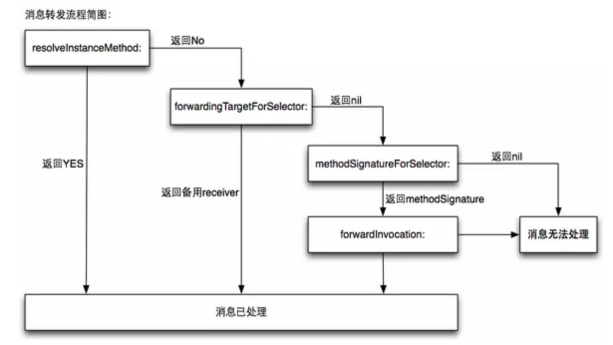

#### 动态方法解析

调用一个方法的流程

首先，Runtime 系统会把方法调用转化为消息发送，即 objc_msgSend，并且把方法的调用者，和方法选择器，当做参数传递过去；

此时，方法的调用者会通过 isa 指针来找到其所属的类，然后在 cache 或者 methodLists 中查找该方法，找得到就跳到对应的方法去执行；

如果在类中没有找到该方法，则通过 super_class 往上一级超类查找；如果一直找到 NSObject 都没有找到该方法的话，一般情况下程序会crash，错误信息类似下面这样：

unrecognized selector sent to instance 0x7fd0a141afd0

但是在程序crash之前，Runtime 会给我们动态方法解析的机会，消息发送的步骤大致如下：

1.检测这个 selector 是不是要忽略的。比如 Mac OS X 开发，有了垃圾回收就不理会 retain，release 这些函数了

2.检测这个 target 是不是 nil 对象。ObjC 的特性是允许对一个 nil 对象执行任何一个方法不会 Crash，因为会被忽略掉

3.如果上面两个都过了，那就开始查找这个类的 IMP，先从 cache 里面找，完了找得到就跳到对应的函数去执行

如果 cache 找不到就找一下方法分发表

4.如果分发表找不到就到超类的分发表去找，一直找，直到找到NSObject类为止

如果还找不到就要开始进入消息转发了，消息转发的大致过程如图：



1.进入 resolveInstanceMethod: 方法，指定是否动态添加方法。若返回NO，则进入下一步，若返回YES，则通过 class_addMethod 函数动态地添加方法，消息得到处理，此流程完毕。

2.resolveInstanceMethod: 方法返回 NO 时，就会进入 forwardingTargetForSelector: 方法，这是 Runtime 给我们的第二次机会，用于指定哪个对象响应这个 selector。返回nil，进入下一步，返回某个对象，则会调用该对象的方法。

3.若 forwardingTargetForSelector: 返回的是nil，则我们首先要通过 methodSignatureForSelector: 来指定方法签名，返回nil，表示不处理，若返回方法签名，则会进入下一步。

4.当第 methodSignatureForSelector: 方法返回方法签名后，就会调用 forwardInvocation: 方法，我们可以通过 anInvocation 对象做很多处理，比如修改实现方法，修改响应对象等。

```
 //调用Monkey的fly方法
 Monkey *monkey = [[Monkey alloc]init];
((void(*)(id,SEL)) objc_msgSend)(monkey,sel_registerName("fly"));

// Monekey类
#import <Foundation/Foundation.h>
@interface Monkey : NSObject
@end

#import "Monkey.h"
#import "Bird.h"
#import <objc/runtime.h>
@implementation Monkey
- (void)jump{
    NSLog(@"%s monkey  can not fly, but it monkey can jump",__FUNCTION__);
}

+ (BOOL)resolveClassMethod:(SEL)sel{
    /*
     如果当前对象调用了一个不存在的方法
     Runtime会调用resolveInstanceMethod:来进行动态方法解析
     我们需要用class_addMethod函数完成向特定类添加特定方法实现的操作
     返回NO，则进入下一步forwardingTargetForSelector:
     */
#if 0
    return NO;
#else
    class_addMethod(self, sel, class_getMethodImplementation_stret(self, sel_registerName("jump")), "v@:");
    return [super resolveClassMethod:sel];
#endif
}

- (id)forwardingTargetForSelector:(SEL)aSelector
{
    /*
     在消息转发机制执行前，Runtime 系统会再给我们一次重定向的机会
     通过重载forwardingTargetForSelector:方法来替换消息的接受者为其他对象
     返回nil则进步下一步forwardInvocation:
     */
#if 0
    return nil;
#else
    return [[Bird alloc]init];
#endif
}
- (NSMethodSignature *)methodSignatureForSelector:(SEL)aSelector
{
    /* 获取方法签名进入下一步，进行消息转发 */
    return [NSMethodSignature signatureWithObjCTypes:"v@:"];
}

- (void)forwardInvocation:(NSInvocation *)anInvocation
{
    /* 消息转发*/
    return [anInvocation invokeWithTarget:[[Bird alloc]init]];
}
@end


//Bird类

#import <Foundation/Foundation.h>
@interface Bird : NSObject
- (void)fly;
@end

#import "Bird.h"
@implementation Bird
- (void)fly
{
    NSLog(@"%s Hi, I Can Fly~~~",__FUNCTION__);
}
@end
```
