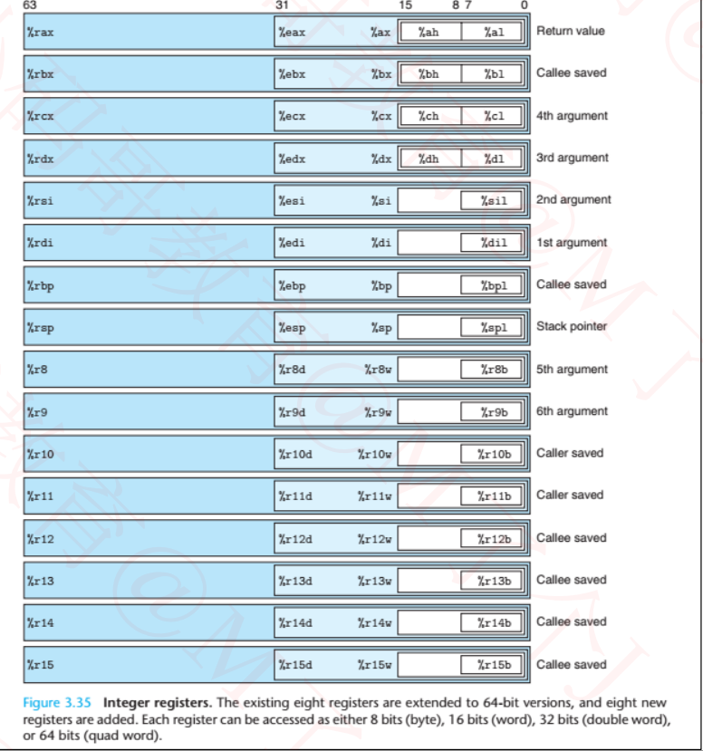
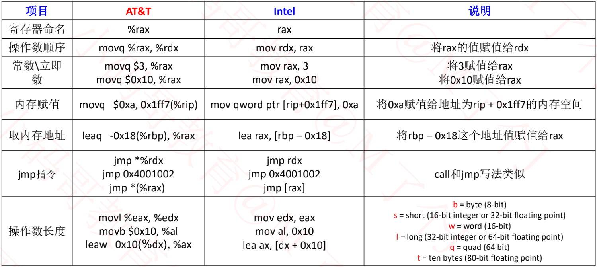
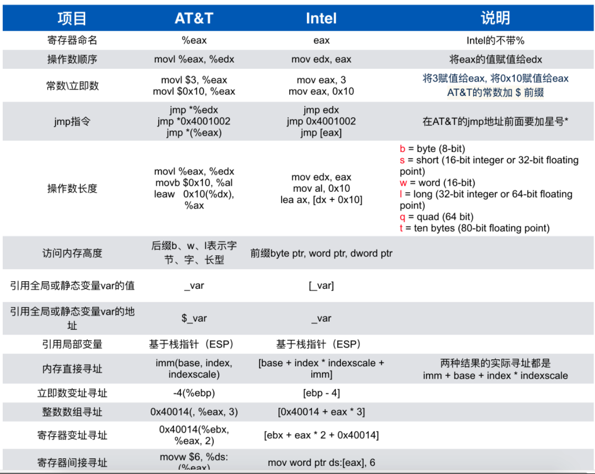

# AT&T汇编

参考： https://www.jianshu.com/p/0480e431f1d7

​			MJ的Swift课程

1. 基于 **x86 架构** 的处理器所使用的汇编指令一般有两种格式.

- Intel 汇编
  - DOS(8086处理器), Windows
  - Windows 派系 -> VC 编译器
- AT&T汇编
  - Linux, Unix, Mac OS, iOS(模拟器)
  - Unix派系 -> GCC编译器

2. 基于**ARM 架构** 的处理器所使用的汇编指令一般有一种格式, 这种处理器常用语嵌入式设备, 移动设备, 以高性能, 低能耗见长

所以：

**AT&T汇编**：iOS模拟器

**ARM汇编**：iOS真机设备

## 64位 AT&T汇编的寄存器

1. 有16个常用的64位寄存器

- rax,  rbx,  rcx ,  rdx,  rsi,  rdi,  rbp,  rsp (和 8086汇编类似 )
- r8, r9, r10, r11, r12, r13, r14, r15

2. 寄存器的具体用途

- **rax**，**rdx** 作为函数返回值使用.
- **rsp** ，**rbp**  用于栈操作
- rdi,  rsi,  rdx, rcx,  r8,  r9,  r10等寄存器用于存放函数参数.
- **rip**作为指令指针
  - 存储着CPU下一条要执行的指令的地址
  - 一旦CPU读取一条指令，**rip**会自动指向下一条指令（存储下一条指令的地址）

64位, 32位, 16位, 8位 寄存器的显示.

常见汇编指令

## 调试

**在解析汇编程序的时候, 有一些 LLDB 指令是很好用的**

- 读取寄存器的值: **register read/x $rax**, 这里x 指 16进制格式, 还有 f 浮点数, d 十进制数

- 修改寄存器的值: **register write $rax 0**

- 读取内存中的值:
  - x/数量-格式-字节大小 内存地址
  - x/3xw 0x0000010,  这里 w 指的是4个字节大小
  - **b, byte, 1字节**;  **h, hard word, 2字节**;  **w, word, 4字节**;  g, giant word, 8字节.

- 修改内存中的值:
  - memory write 内存地址 数值
  - memory write 0x0000010 10
- 寻址: image lookup --address 内存地址

#### **运行指令**

- thread step-over /  next  / n

  单步运行，把子函数当做整体一步执行（源码级别）

- thread step-in  /   step    /  s

  单步运行，遇到子函数会进入子函数（源码级别）

- thread step-inst-over   /   nexti   /   ni

  单步运行，把子函数当做整体一步执行（汇编级别）

- thread step-inst   /   stepi   /   si

  单步运行，遇到子函数会进入子函数（汇编级别）

- thread step-out    /   finish

  - 直接执行完当前函数的所有代码，返回到上一个函数（遇到断点会卡住）

#### 规律

内存地址格式： **0x4bdc(%rip)**,一般是全局变量，全局区（数据段）

内存地址格式：**-0x78(%rip)**，一般是局部变量，栈空间

内存地址格式：**0x10(%rax)**，一般是堆空间