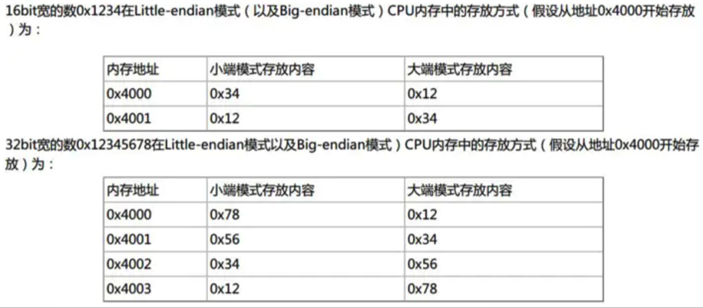
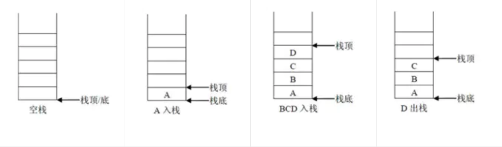
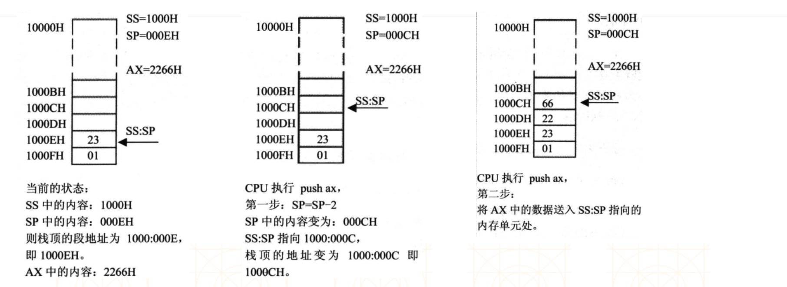
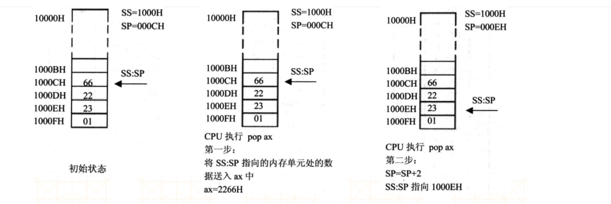

## 指令的使用


#### 大端模式和小端模式

- 大端模式(**Big Endian**): 指数据的`高字节`保存在内存的`低地址`中，而数据的`低字节`保存在内存的`高地址`中 ( **高低\低高** )

- 小端模式(**Little Endian**): 指数据的`高字节`保存在内存的`高地址`中，而数据的`低字节`保存在内存的`低地址`中 ( **高高\低低** )




大端模式: PowerPC, IBM, Sun
小端模式: x86, DEC.
ARM 既可以工作在大端模式, 也可以工作在小端模式.


#### 转移指令

8086 提供了一个 `mov` 指令, **传送指令**, 可以用来修改大部分寄存器的值,
 CPU 从何处执行指令是由 CS, IP 中的内容决定的, 我们可以通过 `Jmp` 这类**转移指令**, 来修改 CS, IP 的值来控制 CPU 执行目标指令.

1. jmp 2AE3: 3, 执行后: CS=2AE3H,  IP= 0003H, CPU将从 **2AE33H** 处读取指令.
    jmp 段地址: 偏移地址  : 用指令中的段地址, 来修改 CS 的值, 用偏移地址来修改 IP 的值.

2. jmp ax, 指令执行前: ax= 1000H, CS=2000H. IP=0003H
    指令执行后: ax= 1000H, CS=2000H. IP=0003H

   - jmp 某一合法寄存器  :  用寄存器中的值来修改IP.

   - jmp ax, 在含义上类似, mov IP,  ax.

3. jmp 0100H,  直接改变 IP 的值.


#### DS和[address]

CPU 要读写一个内存单元时, 必须要先指出内存单元的地址, 在 8086 中, 内存地址(物理地址) 由 段地址 和 偏移地址 组成.

8086 中有一个 DS段寄存器, 通常用来存放要访问的数据的段地址


如：

对 **al寄存器** 写数据

```assembly
mov bx, 1000H
mov ds, bx
mov al, [0]
```

1. 上面3条指令的作用将10000H（1000:0）中的内存数据赋值到 **al寄存器** 中.

2. mov al,[address] 的意思将 **DS:address** 中的内存数据赋值到 **al寄存器** 中.

3. 由于 **al** 是8位寄存器，所以是将一个字节的数据赋值给 **al寄存器**.

4. 8086不支持将数据直接送入到 **段寄存器**, 不能直接 mov ds, 1000H


对 **al寄存器** 读数据

```assembly
mov bx, 1000H
mov ds, bx
mov [0], al
```


#### mov 指令, add 指令, sub 指令

add , sub 和 mov 一样, 都有两个操作对象.

```assembly
mov 寄存器, 数据  比如: mov ax, 8
mov 寄存器, 寄存器  比如: mov ax, bx
mov 寄存器, 内存单元  比如: mov ax, [0]
mov 内存单元, 寄存器  比如: mov [0], ax
```


### 栈

**栈** 是一种具有特殊访问方式的空间 (后进先出, LIFO, Last In First Out)



- 8086 会将 **CS** 作为代码段的段地址，将 **CS:IP** 指向的指令作为下一条需要取出执行的指令

- 8086 会将 **DS** 作为数据段的段地址，**mov ax,[address]** 就是取出 **DS:address** 的内存数据放到 **ax寄存器** 中.

- 8086 会将 **SS** 作为栈段的段地址，任意时刻，**SS:SP** 指向栈顶元素.

- 8086 提供了 **PUSH** (入栈) 和 **POP** (出栈) 指令来操作 **栈段** 的数据.

  比如 **push ax** 是将 ax的数据入栈，**pop ax** 是将栈顶的数据送入ax


##### push ax

1. SP = SP - 2, SS: SP 指向当前栈顶前面的单元, 以 **当前栈顶** 前面的单元为新的栈顶.
2. 将 ax 中的内容送入到 SS: SP 指向的内存单元处, SS:SP 此时指向新栈顶.




##### pop ax

1. 将 SS: SP 指向的内存单元处的数据送入 ax 中.
2. SP = SP + 2, SS: SP 指向当前栈顶下面的单元, 以 **当前栈顶** 下面的单元为新的栈顶.




值得注意的是, 随着 push 和 pop 的操作, 原来内存单元上的数据并没有被清楚掉, 而是随着 SP 的变化, 称为垃圾数据, 当有新的数据 push 进来时, 原数据会被覆盖.


**push 与pop**

```assembly
push 寄存器  ; 将一个寄存器中的数据入栈
pop 寄存器   ; 出栈, 用一个寄存器接收出栈的数据
push 内存单元 ; 将一个内存单元处的字入栈
pop 内存单元  ; 出栈, 用一个内存字单元接收出栈的数据
mov ax, 1000H
mov ds, ax   ; 内存单元的段地址放在 ds 中
push [0]     ; 将 1000: 0 处的字压入栈.
pop [2]      ; 出栈, 出栈的数据送入 1000: 2处
```


小结:

- 对于 **数据段** , 将它的段地址放在 DS 中, 用 mov, add, sub 等访问内存单元的指令时, CPU  就将我们定义的数据段中的内容当做数据来访问.
- 对于 **代码段** , 将它的段地址放在 CS 中, 将段中的第一条指令的偏移地址放在 IP 中, 这样 CPU 就将执行我们定义的代码段中的指令.
- 对于 **栈段** , 将它的段地址放在 SS 中, 将栈顶单元的偏移地址放在 SP 中, 这样 CPU 在需要进行 pop / push 等操作时, 就将我们定义的栈段当做栈空间来用.


# 函数调用


### call 和 ret 指令: 函数的调用

- call 标号 : 将下一条指令的偏移地址入栈后, 转到标号处执行指令
- ret : 将栈顶的值出栈, 赋值给 ip..


下面是代码的一部分, 功能是 调用 print '函数', 打印字符串

```assembly
; 代码段
code segment
start:
    ; 手动设置ds, ss 的值
    mov ax, data
    mov ds, ax
    mov ax, stack
    mov ss, ax

    ; 业务逻辑
    call print
    
    ; 程序退出
    mov ah, 4ch
    int 21h

    ; 如果这里程序不退出, 它会继续向下执行 print 这个函数, 'print' 在这里只是相当于一个标志

print:
    ; ds: dx 告知字符串地址
    lea dx, string
    mov ah, 9h  ; 功能号 9h 指在屏幕上显示字符串
    int 21h     ; 执行 DOS 系统功能调用.
    ret

code ends 

end start 
```

1. **call print**, `print` 这里就是一个标号(函数名), `call` 将下一条指令的偏移地址入栈后, 转到 print 处执行指令, 这个 `下一条指令` 就是 `mov ah, 4ch`.

2. 当 print 处的代码执行完后,  每个函数都会有一个 **ret** 指令, 这个指令会将栈顶的值出栈,  栈顶的值就是 `mov ah, 4ch` 这条指令的偏移地址,   赋值给 ip.  导致 print 函数执行完后, 可以继续向下执行其他的指令.


例：

```assembly
assume cs:code, ds:data, ss:stack

; 栈段
stack segment
    db 100 dup(0)
stack ends  

; 数据段
data segment  
    db 100 dup(0) 
data ends

; 代码段
code segment
start:
    ; 手动设置ds、ss的值
    mov ax, data
    mov ds, ax
    mov ax, stack
    mov ss, ax 
    
    mov si, 1
    mov di, 2
    mov bx, 3 
    mov bp, 4
    
    ; 业务逻辑
    push 1
    push 2 
    call sum 
    add sp, 4 
    
    ; 退出
    mov ax, 4c00h
    int 21h 
    
; 返回值放ax寄存器
; 传递2个参数(放入栈中)    
sum:
    ; 保护bp    
    push bp
    ; 保存sp之前的值：指向bp以前的值
    mov bp, sp
    ; 预留10个字节的空间给局部变量 
    sub sp, 10
    
    ; 保护可能会用到的寄存器
    push si
    push di
    push bx 
    
    ; 给局部变量空间填充int 3（CCCC）
    ; stosw的作用：将ax的值拷贝到es:di中,同时di的值会+2
    mov ax, 0cccch
    ; 让es等于ss
    mov bx, ss
    mov es, bx 
    ; 让di等于bp-10（局部变量地址最小的区域）
    mov di, bp
    sub di, 10   
    ; cx决定了stosw的执行次数
    mov cx, 5  
    rep stosw  
    ; rep的作用：重复执行某个指令（执行次数由cx决定）
     
    ; -------- 业务逻辑 - begin
    ; 定义2个局部变量
    mov word ptr ss:[bp-2], 3 
    mov word ptr ss:[bp-4], 4 
    mov ax, ss:[bp-2]
    add ax, ss:[bp-4]
    mov ss:[bp-6], ax 
    
    ; 访问栈中的参数
    mov ax, ss:[bp+4]
    add ax, ss:[bp+6] 
    add ax, ss:[bp-6]   
    ; -------- 业务逻辑 - end 
    
    ; 恢复寄存器的值
    pop bx
    pop di
    pop si
                       
    ; 恢复sp
    mov sp, bp
    ; 恢复bp
    pop bp
    
    ret 
                
code ends  

end start
```

说明

- 1.push 参数
- 2.push 函数的返回地址
- 3.push bp  (保留bp之前的值，方便以后恢复)
- 4.mov bp, sp  (保留sp之前的值，方便以后恢复), SP 栈顶指针寄存器, BP, 基址指针寄存器
- 5.sub sp,空间大小  (分配空间给局部变量)
- 6.保护可能要用到的寄存器
- 7.使用CC ( int 3) 填充局部变量的空间
- 8.--------执行业务逻辑--------
- 9.恢复寄存器之前的值
- 10.mov sp, bp (恢复sp之前的值)
- 11.pop bp  (恢复bp之前的值)
- 12.ret (将函数的返回地址出栈，执行下一条指令)
- 13.恢复栈平衡  (add sp,参数所占的空间)
  - 栈平衡: 函数调用前后的栈顶指针要一致. 栈如果不平衡, 栈空间迟早会被用完.
  - 栈平衡分内平栈 和 外平栈


