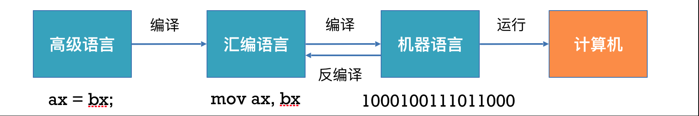
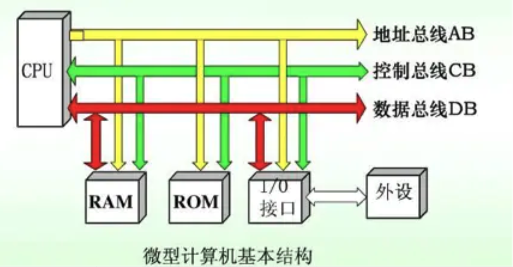
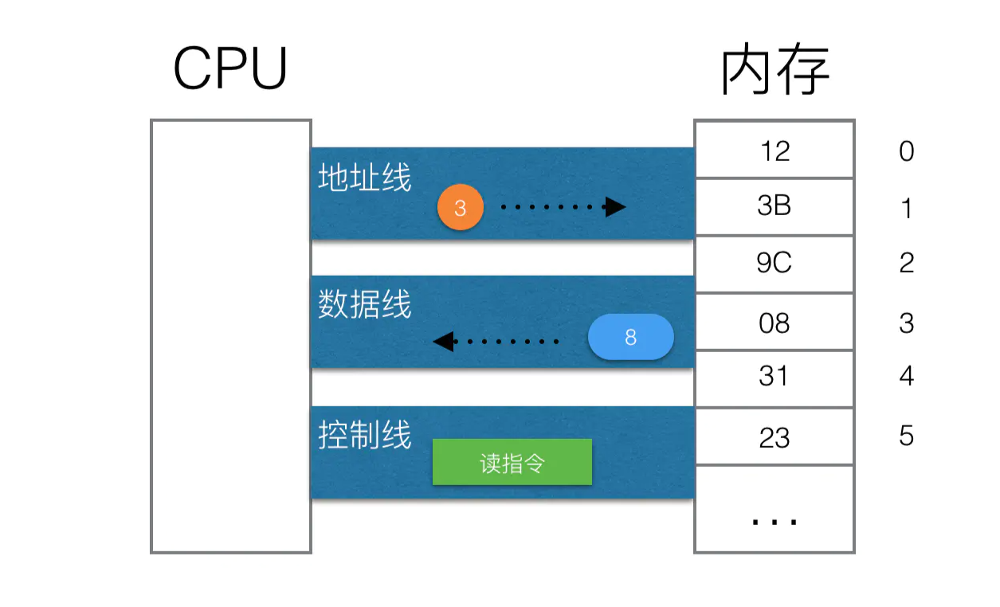
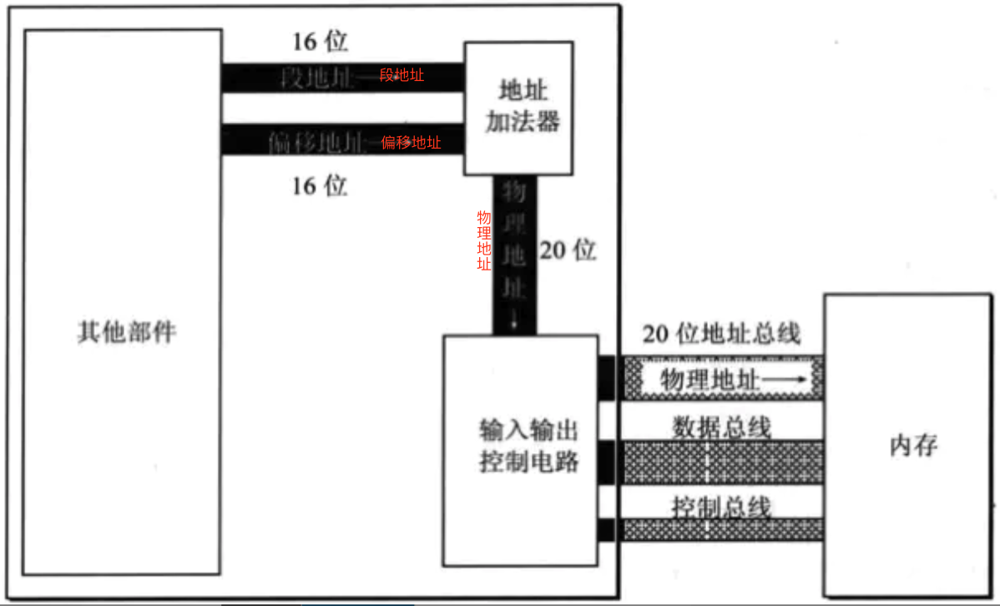
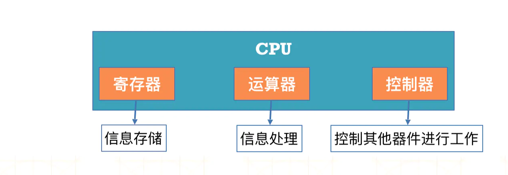
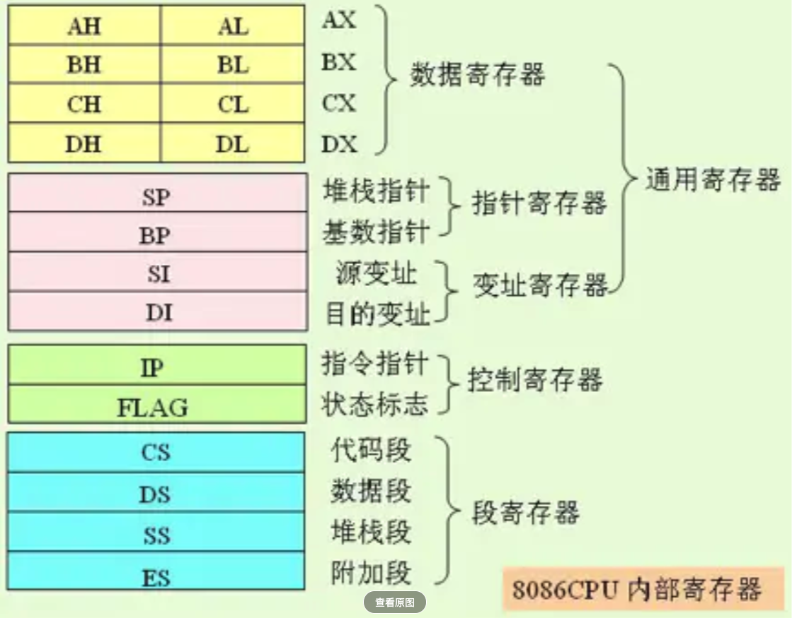
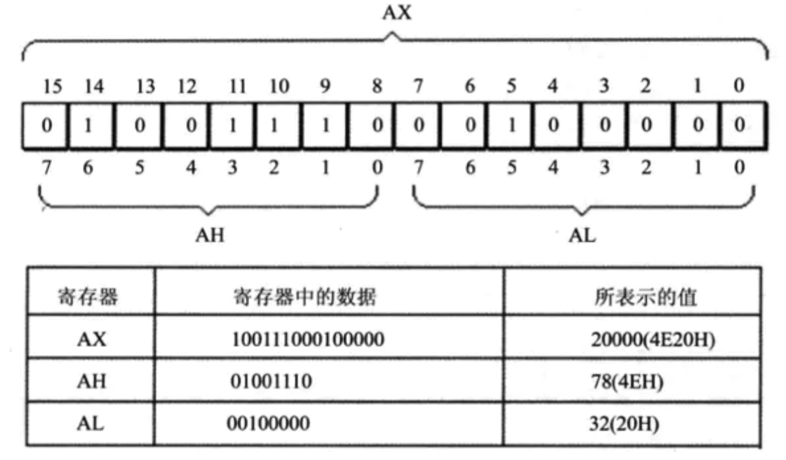
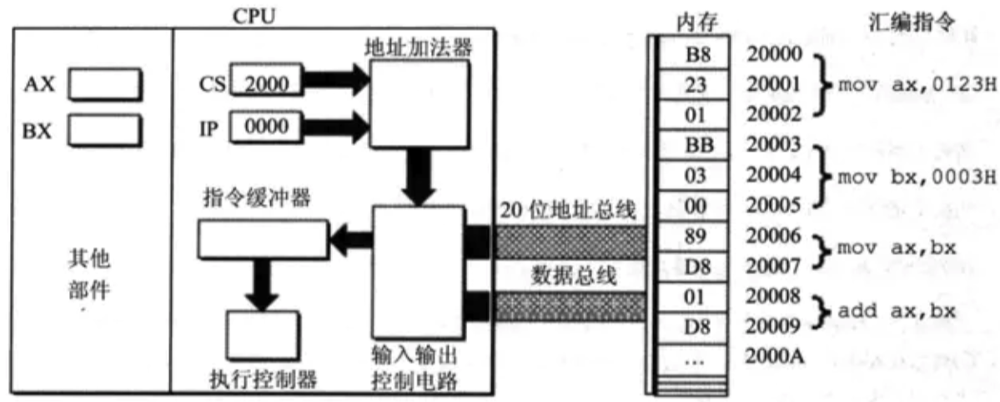

### 汇编概论

参考：https://www.jianshu.com/p/8faabed0eedb


#### 编程语法发展

- 机器语言: 由 0 和 1 组成.

- 汇编语言(Assembly Language): 用符号代替了 0 和 1, 比机器语言更加便于阅读和记忆.

- 高级语言: C\C++\Java\Swift等, 更加接近于人类自然语言.


```assembly
如： 将寄存器 BX 的内容送到寄存器 AX.

机器语言: 1000100111011000
汇编语言: mov ax, bx
高级语言: ax = bx
```





- 汇编语言与机器语言一一对应，每一条机器指令都有与之对应的汇编指令

- 汇编语言可以通过编译得到机器语言，机器语言可以通过反汇编得到汇编语言

- 高级语言可以通过编译得到汇编语言/机器语言，但汇编语言/机器语言几乎不可能还原成高级语言


#### 汇编语言的特点

- 可以直接访问, 控制各种硬件设备, 比如存储器, CPU等, 能最大限度发挥硬件的功能.

- 汇编指令是机器指令的助记符, 和机器指令一一对应, 每一种CPU都有自己的机器指令集 \ 汇编指令集, 所以汇编语言不具备可移植性.

- 不区分大小写, mov 和 MOV 是一样的.


#### 汇编语言的分类


##### 按照指令集架构分类:

- **8086汇编(16bit)**, x86系列第一款. 我们学习的就是这一种,

- **x86汇编(32bit)**, 这种架构常被称为i386, `x86`, 它是 Intel 设计的

- **x86汇编(64bit)**, 这种架构常被称为 AMD64, Intel64, x86-64, `x64`, 它是 AMD 设计的, 是x86架构的64位扩展, 后来公开, 也被Intel所采用, 故现在也称为 Intel64.

- **ARM汇编**, ARM处理器由于高性能, 低耗电, 常用于嵌入式, 移动设备.

- 其他


##### 按照汇编格式分类: 这几种基本上是符号系统的区别

- **Intel 格式**
- **AT&T 格式**
- **ARM 格式**
- 其他


值的一提的是

- **x86** 汇编指令的风格是 **Intel** 汇编, 被 Microsoft Windows, Visual C++ 采用.
- **x64** 汇编指令的风格是 **AT&T** 汇编, 被 GNU, Gas 采用(Gas 也可使用Intel汇编).
- **ARM** 汇编指令的风格是 **ARM** 汇编.被 Apple 采用. 应用于 iPhone 真机.


#### 软件/程序执行的过程


每一个CPU芯片都有许多管脚, 这些管脚和**总线**(Bus)相连, CPU 通过总线跟外部器件交互.




**地址总线**(Address Bus): 它的宽度决定了 CPU 的寻址能力

**数据总线**(Data Bus): 它的宽度决定了 CPU 的单次数据传送量, 也就是数据传输速度.

**控制总线**(Control Bus): 它的宽度决定了 CPU 对其他器件的控制能力, 能有多少控制.


简单来说：



- CPU 通过**控制总线**传输读命令, 通过**地址总线**指定是内存中的3号单元, 通过**数据总线**传输数据 0000 1000 (08)

- 这里面的 0, 1 是指的是线路中的 高电平, 低电平. 线路越宽, 能传输的数据越多


**练习:**

- 1 个 CPU 的寻址能力是 8 KB, 那么他的地址总线的宽度数: `13`,  因为  8KB = 2^13

- 8086, 8088, 80286, 80386 的地址总线宽度为16根, 20根, 24根, 32根, 那么他们的寻址能力分别是 

  `64KB, 1MB, 16MB, 4GB`

   因为

  - **2^10 = 1KB,  2^16 = 64 KB**
  - **2^20 = 1024KB = 1 MB**
  - **2^24 = 16 * 1024KB = 16 MB**
  - **2^32 = 2^12 * 1MB = 4 * 1024 * 1MB = 4GB**

- 8086, 8088, 8086, 80286, 80386 的数据总线宽度为8根, 8根, 16根, 16根, 32根, 那么他们一次可以传送的数据是: `1B, 1B, 2B, 2B, 4B` ， 

  因为传输 1Byte 的数据实际是8bit .

- 从内存中读取 1024 字节的数据, 8086至少读 `512` 次,

  - 因为 1024B = 2^10 B, 8086 的传输速度是 2B / 次, 所以需要 512 次.


多说一句, 1 字节  = 8 位, 1 Byte = 8 bit, 我们常说的 64 位操作系统, 指的是CPU 每次能处理 64 bit 的数据.


**8086的寻址方式**

- CPU访问内存单元时, 要给出内存单元地址.
- 8086有 `20位` 的地址总线, 可以传送 `20` 位的地址, `1M` 的寻址能力.
- 但它又是 `16位` 结构的CPU, 它内部能够一次性处理, 传输, 暂时存储的地址为 `16位`. 如果将地址从内部简单发出, 那么它只能送出 `16位` 的地址, 表现出来的寻址能力只有 `64KB`
- 所以8086采用了一种在内部使用 `2个16位` 地址合成的方式来生成 `1个20位` 的物理地址



地址加法器采用 **物理地址 = 段地址 x 16 + 偏移地址** 的方式合成物理地址.

8086CPU的要访问的同一个 **物理地址** 可以由不同的 **段地址** 和 **偏移地址** 组成.


### CPU的典型构成



不同的 CPU, 寄存器的个数, 结构是不同的, 8086 有 14 个寄存器, 都是16位 寄存器, 每个可以存放 2个 字节.




寄存器是有限存贮容量的高速存贮部件，它们可用来暂存指令、数据和地址.


#### **通用寄存器**

1. AX, BX, CX, DX这四个寄存器通常用来存放一般的数据, 也被称为是 **通用寄存器**, 通常, CPU会先将内存中的数据存储到通用寄存器中, 然后再对通用寄存器中的数据进行运算.

2. 假设内存中有一块内存空间的值是 3, 现在想把它的值加 1 , 并将结果存储在新的内存空间中.
   - mov ax, srcMemory: CPU 先将原来内存空间的值存在寄存器中
   - add ax, 1 : 让寄存器`ax`与 1 相加.
   - mov desMemory, ax : 将值赋给新的内存空间.

3. AX, BX, CX, DX这四个通用寄存器是16位的, 里面AH, AL 分别代表高位寄存器, 和低位寄存器, 其他同理.




在汇编的数据存储中

- 字节: byte, 1 个字节由8 bit组成
- 字: word, 1个字由2个字节组成

上面展示的数据 20000 (4E20H),  字: 010011100 0100000B, 左边是 高八位, 右边是低八位.


#### **段寄存器**

 8086 存在4个段寄存器, 当 CPU 需要访问内存时, 由这4个提供段寄存器提供内存单元的 **段地址**.

- CS (Code Segmnet): 代码段寄存器
- DS (Data Segmnet): 数据段寄存器
- SS (Stack Segmnet): 堆栈段寄存器
- ES (Extra Segmnet): 附加段寄存器





1. 8086CPU 当前状态: CS 中的内容为 2000H, IP 中的内容是 0000H, CS 为代码段寄存器, IP (Instruction Pointer Segment)为指令指针寄存器, 他们指示了 CPU 当前要读取指令的地址.
2. 内存 20000H ~ 20009H 单元存放着可执行的机器码.

- 地址: 20000H ~ 20002H, 内容: B8 23 01, 长度 3 Byte, 汇编指令: mov ax,  0123H
- 地址: 20003H ~ 20005H, 内容: BB 03 00, 长度 3 Byte, 汇编指令: mov bx,  0003H
- 地址: 20006H ~ 20007H, 内容: 89 D8, 长度 2 Byte, 汇编指令: mov ax,  bx
- 地址: 20008H ~ 20009H, 内容: 01 D8, 长度 2 Byte, 汇编指令: mov ax,  bx


下面将详细就介绍 CPU 如何处理汇编指令.   对照上图

1. CS, IP 中的内容送到 **地址加法器** 中, 物理地址 = 段地址 x 16 + 偏移地址, 输出 20000H
2. **地址加法器** 将物理地址送入到 **输入输出控制电路**.
3. **输入输出控制电路** 将物理地址 20000H 输入到 **地址总线** 开始寻址.
4. 从内存 20000H 单元开始存放的机器指令 **B8 23 01** 通过 **数据总线** 被送入到 CPU.
5. **输入输出控制电路** 将机器指令 **B8 23 01** 送入**指令缓冲器**
   - 此时 IP 中的值自动增加, 以便CPU 可以读取下一条指令
   - 因为当前读入的指令 **B8 23 01** 长度为 3 个字节, 所以 IP 中的值加 3, 此时CS: IP执行内存单元 2000: 0003
6. **执行控制器** 执行指令 **B8 23 01**, 即 mov ax, 0123H, 此时 AX 中的内容为 0123H.
7. CPU 从内存 20003H 处读取指令 **BB 03 00**, 送入 **指令缓冲器**, 此时 IP 再次加 3.
8. 执行指令 **BB 03 00** 即 mov bx, 0003H.
9. CPU 从内存 20006H 处读取指令 **89 D8**, 输入指令缓冲器. 此时 IP 值加 2.
10. 执行指令 **89 D8**, 即 mov ax, bx,  AX 中的内容变为 0003H.
11. CPU 从内存 20008H 读取指令 **01 D8** 入指令缓冲器. IP 的值加 2 .
12. 执行指令 **01 D8**, 即 add ax, bx, AX 中的内容变为 0006H.


上面这个过程可以简述为

1. 从 CS: IP 指向的内存单元读取指令, 读取的指令进入指令缓冲器.
2. IP = IP + 所读取指令的长度, 从而指向下一个指令的.
3. 执行指令, 重复步骤1, 重复这个过程.


### 指令和数据

看完上面这个过程, 我们会发现 指令和 数据都是二进制信息,
比如 内存中二进制信息 **10001001 11011000**, 既可当做数据 **89D8H** , 也可当做指令 **mov ax, bx**


CPU 怎么区分指令和数据？

计算机加载的第一条肯定是指令，然后根据这条指令去取二进制数，如果这条指令要取操作数，那么取出来的就是操作数；如果这条指令要取下一条指令，那么取出来得就是指令。 
把指令和数据分开放是为了安全和逻辑结构清晰。 


指令和数据存放的格式一样，但是访问他们的时机不同 

在取指令时期，cpu通过指令流取指令，存放在指令寄存器， 然后解释并执行指令，

在执行指令时期，cpu通过数据流取数据， 存放在数据寄存器。 

所以指令流取的是指令，数据流取的是数据。 

其实很简单，在取指令周期取得就是指令，读数据周期读的就是数据了